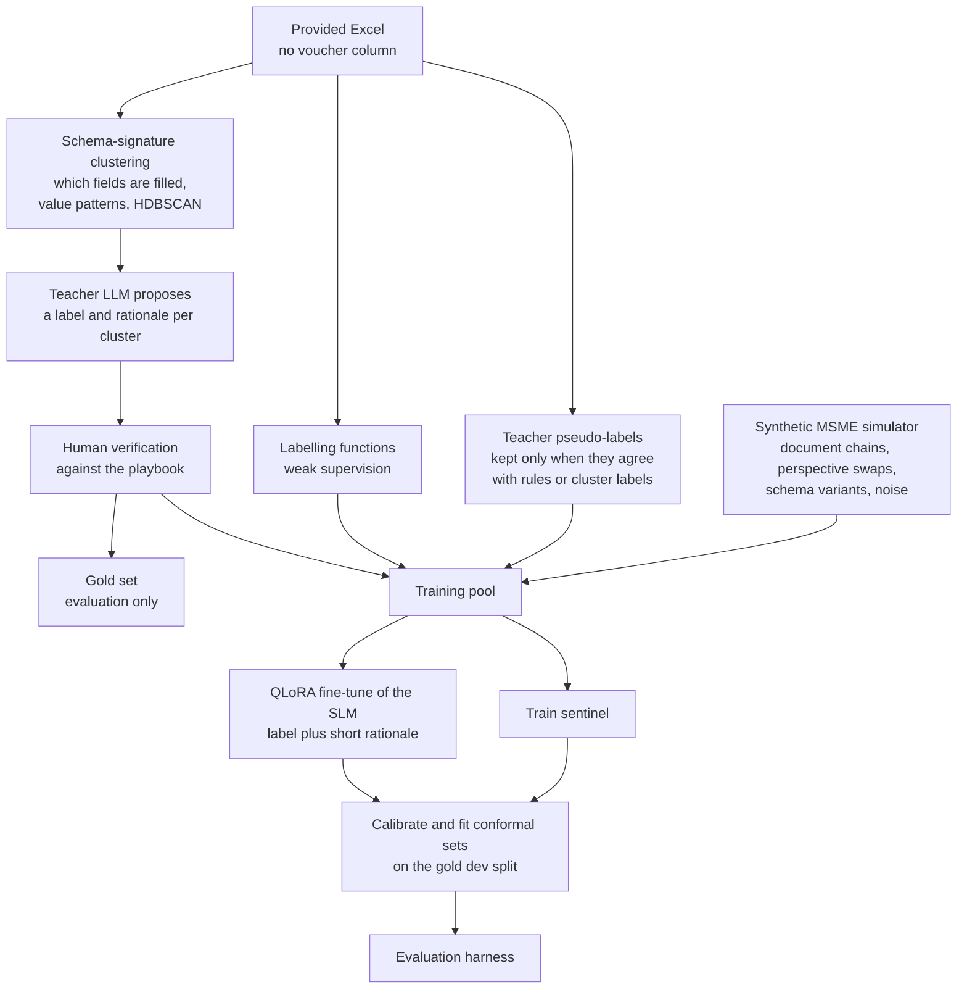
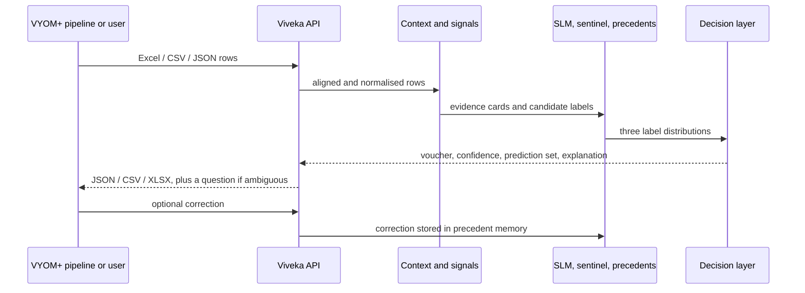

# Viveka: open-source voucher intelligence for VYOM+

> **Hacktober Fest 2026 · Open Source AI Hackathon, organised by Elevate**
> **Problem Statement 4:** VYOM+ Intelligent Voucher Classification Using Open-Source LLMs
> **Implementation:** the classification pipeline, FastAPI backend, training tools and a React / Next.js frontend are now included. The architecture below records the original proposal; see [frontend setup and current capabilities](docs/FRONTEND.md) for the shipped web app.

**विवेक (viveka)** is Sanskrit for *discernment*: the ability to tell apart things that look alike. Viveka reads structured transaction data and picks the right accounting voucher for every row. Is it a Purchase or a Sales voucher? Contra or Payment? Credit Note or Rejection In? It answers by reasoning over the whole transaction with an open-weight language model, and it explains every decision.

## Run the web app

Start the API from the repository root (Python 3.12+):

```bash
python -m pip install -e ".[api]"
viveka serve --host 127.0.0.1 --port 8000
```

In a second terminal (Node 22.12+ or 24):

```bash
cd apps/web
npm ci
npm run dev
```

Open the URL printed by Next.js. The app connects to the backend on port 8000 by default.
Use the sample ledger or upload Excel, CSV, JSON or JSONL. Review uncertain classifications
and export your final decisions. [Configuration, tests and limitations](docs/FRONTEND.md).

## Contents

1. [Problem](#1-problem)
2. [Proposed solution](#2-proposed-solution)
3. [Target users](#3-target-users)
4. [Selected open-source AI technology](#4-selected-open-source-ai-technology)
5. [AI's role](#5-ais-role)
6. [Architecture](#6-architecture)
7. [Data flow](#7-data-flow)
8. [Technology stack](#8-technology-stack)
9. [Implementation plan](#9-implementation-plan)
10. [Expected output](#10-expected-output)
11. [Scalability](#11-scalability)
12. [Dependencies](#12-dependencies)
13. [Expected challenges](#13-expected-challenges)

[References](#references)

---

## 1. Problem

### VYOM+ and the booking decision

VYOM+ describes itself as *"the accounting and GST filing assistant built for India's 63M+ MSMEs"*. Its promise is *"Snap a bill. We book it, reconcile it, file it — and check if you're owed money you haven't claimed."* The pitch centres on unclaimed input tax credit (ITC): *"₹1–2 lakh. Sitting in your GST account right now."* and a *"Nov 30"* deadline. Under section 16(4) of the CGST Act, ITC for a financial year can only be claimed until 30 November of the following year, or until the annual return is filed if that comes first.

Every transaction VYOM+ books passes through one decision: **which voucher does this transaction become?** That single label decides three things:

- **The ledger effect.** Which accounts are debited and credited, and whether stock moves.
- **The GST effect.** Whether the row is an outward supply (GSTR-1), an inward supply with ITC (GSTR-3B Table 4), a credit or debit note, an advance, or a challan that is only a document.
- **Whether ITC is found or lost.** An import booked as a plain purchase, or a purchase buried in a journal, is exactly how credit goes unclaimed.

### The challenge

VYOM+ provides an Excel file in which each row is one transaction. The fields include seller and buyer, invoice number and date, items, quantities, taxable value, GST, discounts, freight, payment, currency, import/export details, payroll, debit/credit information, returns, orders and delivery details. The voucher-type column is deliberately missing. The system must assign each row exactly one of 27 categories:

Purchase · Sales · Purchase Return / Debit Note · Sales Return / Credit Note · Payment · Receipt · Contra · Journal · Salary / Payroll · Attendance · Purchase Order · Sales Order · Receipt Note · Delivery Note · Rejection In · Rejection Out · Stock Journal · Physical Stock · Material In · Material Out · Job Work In Order · Job Work Out Order · Import · Export · Expense · Advance / Prepayment · Other / Miscellaneous

The rules for the task are:

- An open-source LLM or SLM has to be the primary intelligence layer.
- The output must be structured so that it can be scored programmatically.
- The system is tested on a hidden dataset with known labels.
- The test looks at accuracy, precision, recall, F1, per-category performance, ambiguous records, output consistency, inference speed and computational efficiency.

### Why it is hard

1. **The same row means different things in different books.** A tax invoice is a Sales voucher for the seller and a Purchase voucher for the buyer, so the system first has to work out *whose books* it is writing.
2. **Keywords mislead.** "Fund transfer for salary" between two of the company's own bank accounts is a **Contra**. It is not Salary / Payroll, and it is not a Payment.
3. **There are 27 classes, many with near-twins.** Credit Note and Rejection In, Receipt Note and Material In, Expense and Purchase, Advance and Payment.
4. **There are no labels.** Nothing in the provided data shows the right answer.
5. **The schema is unknown and data goes missing.** Column names, fill rates and formats in the hidden set may differ from the sample.

Viveka therefore treats this as an accounting-reasoning problem first and a text-classification problem second.

## 2. Proposed solution

### 2.1 Overview

Viveka works in three layers: **Understand**, then **Reason**, then **Decide**.

- **Understand.** Align any schema to a canonical one, normalise Indian formats, and work out the context: whose books these are, which accounts are the company's own, and how rows reference each other.
- **Reason.** Build an *evidence card* for each row, then form three independent opinions: an open-weight SLM adjudicator, a gradient-boosted "sentinel" model, and retrieval of similar verified precedents.
- **Decide.** Fuse and calibrate the three opinions and attach a conformal prediction set. Apply hard accounting guardrails, then either explain the decision or ask one clarifying question.

**Key ideas**

1. **Whose-books resolver.** Viveka infers the company from the data itself: the GSTIN or name that recurs across rows, and the ledgers that behave like its own cash and bank accounts. It can also take the company from the VYOM+ business profile. Purchase/Sales, Payment/Receipt, Import/Export, Rejection In/Out, Purchase Order/Sales Order, Material In/Out and Job Work In/Out all flip on this one fact.
2. **Evidence card.** About 60 typed, deterministic accounting signals, each linked to the cell it came from. The LLM reasons over verified facts instead of raw strings, so every explanation can be traced back to the data.
3. **Label scoring with constrained decoding.** The SLM gives a probability to each of the 27 exact label strings. Decoding is grammar-constrained (XGrammar in vLLM, GBNF or JSON schema in llama.cpp), so the output is always a valid label.
4. **Independent second opinions.** The LightGBM sentinel and the k nearest verified precedents work differently from the SLM. When they agree, confidence rises. When they disagree, the row goes to deliberate reasoning or to review.
5. **Honest uncertainty.** Probabilities are temperature-calibrated and come with a conformal prediction set. A set with more than one label marks the row as genuinely ambiguous, and Viveka says which missing field would settle it.
6. **Document-chain reasoning.** References across rows form a graph: original invoice, purchase or sales order, goods receipt note, challan, Bill of Entry. A return is recognised by what it points to.
7. **Labels from unlabelled data.** Schema-signature clustering, weak supervision and a synthetic MSME simulator produce the training data. A small human-verified gold set is kept apart, purely for honest evaluation.
8. **Policy as configuration.** Some labelling conventions differ between firms, for example whether a paid electricity bill is an Expense or a Payment. These live in a versioned policy file, not in code or model weights.
9. **One-question clarifier.** In VYOM+'s chat, Viveka asks the single question that best splits the remaining candidates, for example *"Is Axis Bank ••9182 one of your own accounts?"*

### 2.2 Voucher decision playbook

This playbook is the domain model behind the signals, the labelling functions, the prompts and the guardrails. It follows TallyPrime's voucher semantics (TallyPrime ships 24 predefined voucher types) and extends them with VYOM+'s additional categories: Import, Export, Expense, Advance / Prepayment and Other / Miscellaneous. In the tables, "Dr" and "Cr" mean the debit and credit legs of the entry.

**Money movements and adjustments**

| Voucher type | What it records in the company's books | Decisive evidence | Usually confused with, and how we separate them |
|---|---|---|---|
| **Payment** | Money paid out of the company's cash or bank to an outside party | The Cr leg is an own cash/bank account; a payment mode (cash, cheque, NEFT, RTGS, IMPS, UPI) with a UTR or cheque number; it settles a bill or statutory dues | **Contra** if the payee is one of the company's own accounts. **Advance** if there is no bill yet. **Expense** if the row is the bill itself |
| **Receipt** | Money received from an outside party | The Dr leg is an own cash/bank account; the payer is a customer or debtor; there is an invoice reference | **Contra**. **Advance** if there is no invoice yet. A cash **Sales** invoice |
| **Contra** | Money moving only between the company's own cash and bank accounts | Both legs are in the own-account registry; "cash deposit", "ATM or cash withdrawal", "self", a petty-cash top-up; no outside party and no GST | **Payment / Receipt**. The own-account test overrides keywords in the narration |
| **Journal** | A non-cash adjustment between ledgers | No cash/bank leg and no stock movement; depreciation, provisions, accruals, write-offs, TDS or GST set-off, rectifications | **Purchase / Sales / Expense**. If a supplier or customer document exists, the row is not a Journal |

**Supply invoices**

| Voucher type | What it records in the company's books | Decisive evidence | Usually confused with, and how we separate them |
|---|---|---|---|
| **Sales** | An outward supply where the company is the supplier | The company is the seller (GSTIN or name match); a tax invoice; output GST; an e-invoice IRN with supply type B2B; the party is a debtor | **Export** if there is cross-border evidence. **Delivery Note** if there are no invoice values. **Sales Order** if nothing has been supplied yet |
| **Purchase** | An inward supply of goods where the company is the recipient | The company is the buyer; a supplier invoice number; HSN goods lines with quantity and unit; input GST; the party is a creditor | **Expense** for services or overheads with no stock. **Import**. **Receipt Note**. **Purchase Order** |
| **Expense** | A bill or claim for an indirect expense or a service consumed | SAC service codes (starting 99); rent, utilities, telecom, professional or legal fees, repairs, travel, freight; TDS under sections 194C, 194J, 194I or 194H; no stock items | **Purchase** for stock goods. **Payment** when an existing bill is being settled. **Journal** for an accrual |
| **Import** | An inward supply from outside India | A foreign supplier (no GSTIN, foreign address); a non-INR currency and exchange rate; a Bill of Entry number and date, port code, basic customs duty and social welfare surcharge, IGST on import; an Importer-Exporter Code (IEC); import of services under reverse charge | **Purchase / Expense**, or a **Payment** sent abroad. Customs or foreign-supplier evidence wins |
| **Export** | An outward supply to outside India | A foreign buyer; a non-INR currency; a shipping bill number and date, port code; a Letter of Undertaking (LUT) or bond; "supply meant for export"; e-invoice supply type EXPWP or EXPWOP; Incoterms | **Sales**: supplies to a Special Economic Zone and deemed exports are settled by policy. A **Receipt** of export proceeds |

**Value corrections**

| Voucher type | What it records in the company's books | Decisive evidence | Usually confused with, and how we separate them |
|---|---|---|---|
| **Sales Return / Credit Note** | A reduction of an earlier sale: goods returned, a discount or a rate difference | The company is the seller; a reference to the original sales invoice; negative quantity or value; a CN prefix; a reason | **Rejection In**, which is a quantity-only return against a delivery note. **Purchase Return**, which is the same note seen from the other side |
| **Purchase Return / Debit Note** | A reduction of an earlier purchase: goods returned to the supplier, a short supply or a rate difference | The company is the buyer; a reference to the original purchase invoice; a DN prefix; a GST reversal | **Rejection Out**, which is a quantity-only return against a receipt note. **Sales Return**, seen from the other side |

**Orders: commitments with no ledger impact**

| Voucher type | What it records in the company's books | Decisive evidence | Usually confused with, and how we separate them |
|---|---|---|---|
| **Purchase Order** | The company orders goods from a supplier | A purchase order number, order and expected-delivery dates, ordered quantity and rate, terms; no supplier invoice and no receipt | **Purchase**. **Receipt Note**. **Job Work Out Order**, which orders processing rather than buying |
| **Sales Order** | A customer orders goods from the company | A sales order number or the customer's purchase order reference, a due date, ordered quantity; no invoice and no dispatch | **Sales**. **Delivery Note**. **Job Work In Order** |
| **Job Work Out Order** | The company, as principal, orders processing from a job worker | A job worker, a process (machining, dyeing, plating), raw material to be sent, the expected finished goods; nothing has moved yet | **Purchase Order**. **Material Out** |
| **Job Work In Order** | The company, as job worker, receives a processing order from a principal | A principal, the finished goods to produce, raw material the principal will supply, a job rate and schedule | **Sales Order**. **Material In** |

**Inventory movements**

| Voucher type | What it records in the company's books | Decisive evidence | Usually confused with, and how we separate them |
|---|---|---|---|
| **Receipt Note** | Goods received from a supplier before, or without, the invoice (a goods receipt note) | A goods or material receipt note number, received quantity, godown, purchase order reference, vehicle or lorry-receipt number; no tax-invoice values | **Purchase** if invoice values are present. **Material In** in a job-work context |
| **Delivery Note** | Goods dispatched to a customer before, or without, the invoice (a delivery challan) | A challan number, dispatched quantity, vehicle number, e-way bill, transporter or lorry receipt, sales order reference; no invoice values | **Sales**. **Material Out** |
| **Rejection In** | A customer rejects and returns goods received under a delivery note | The company is the seller; a reference to the delivery note or challan; returned quantity; a quality-check failure or "rejected"; no credit-note values | **Sales Return / Credit Note** |
| **Rejection Out** | The company rejects and returns goods received under a receipt note | The company is the buyer; a reference to the goods receipt note; rejected quantity; no debit-note values | **Purchase Return / Debit Note** |
| **Material Out** | Material sent under a job-work arrangement: raw material to the job worker, or finished goods back to the principal | A delivery challan for job work (CGST Rule 55); a job worker or principal; a process; ITC-04 context; no sale price | **Delivery Note**. **Sales** |
| **Material In** | Material received under a job-work arrangement: raw material from the principal, or finished goods and scrap back from the job worker | A job-work challan reference; a principal or job worker; raw material consumed; no purchase price | **Receipt Note**. **Purchase** |
| **Stock Journal** | An internal stock transfer or transformation: between godowns, in manufacturing, or for wastage | Source and destination godowns; consumed and produced items; no counterparty and no tax | **Physical Stock**. **Material In / Out** |
| **Physical Stock** | A stock-take, where the counted quantity resets book stock | A count date, the counted quantity, the book quantity or variance; no party | **Stock Journal** |

**People**

| Voucher type | What it records in the company's books | Decisive evidence | Usually confused with, and how we separate them |
|---|---|---|---|
| **Salary / Payroll** | Payroll processing and salary for employees | An employee ID or name and pay period; earnings (basic, HRA, DA, allowances); deductions (PF, ESI, professional tax, TDS under section 192); gross and net pay; UAN or ESIC number | **Payment** for the salary transfer itself (settled by policy). **Attendance**. **Expense** |
| **Attendance** | An attendance or production record that feeds payroll; it carries no money | An employee with days present, absent or on leave, overtime hours or units produced; every monetary field empty | **Salary / Payroll** |

**Timing and fallback**

| Voucher type | What it records in the company's books | Decisive evidence | Usually confused with, and how we separate them |
|---|---|---|---|
| **Advance / Prepayment** | Money paid or received before the supply or invoice, or an expense paid ahead of its period | "Advance", "on account", "against PO/SO", "token", "prepaid"; no invoice reference; a receipt voucher issued for an advance; a service period in the future | **Payment / Receipt**, which settle an invoice. **Journal**, for a prepaid adjustment |
| **Other / Miscellaneous** | A valid record that fits none of the categories above: a memorandum, a reversing entry, an opening balance or a non-accounting row | No decisive evidence for any category after full analysis | Not a dumping ground. It is used only when no label clears its evidence threshold, and it is always reported with the runner-up label |

**Default precedence ladder.** When a row carries evidence for several types, the most specific reading wins. The ladder is used for tie-breaks and guardrails, and the model also learns soft versions of these rules from data. The ladder is part of the versioned policy.

1. People records: Attendance (no money), then Salary / Payroll.
2. Commitments with no movement: Purchase Order, Sales Order, Job Work Out Order, Job Work In Order.
3. Job-work movements: Material Out, Material In.
4. Quantity-only movements: Rejection In / Out (when they reference a delivery or receipt note), then Receipt Note / Delivery Note, then Stock Journal and Physical Stock.
5. Corrections of earlier invoices: Sales Return / Credit Note, Purchase Return / Debit Note.
6. Cross-border supplies: Import, Export.
7. Money before supply: Advance / Prepayment.
8. Money between the company's own accounts: Contra.
9. Settlements: Payment, Receipt.
10. Supply invoices: Sales, Purchase, Expense.
11. Non-cash adjustments: Journal.
12. Fallback: Other / Miscellaneous.

**The confusable pairs named in the problem statement**

| Pair | The question that decides it | How Viveka answers it |
|---|---|---|
| Purchase vs Sales | Is the company the buyer or the seller? | Whose-books resolver: GSTIN or name match, the company inferred across the dataset, input vs output tax ledgers |
| Purchase Return vs Sales Return | Which of the company's own documents is being reversed? | Perspective plus the document-link graph: is the referenced invoice one of our sales or one of our purchases? |
| Salary / Payroll vs others | Is the counterparty an employee, and is there a pay breakdown? | An employee detector and a payroll-component lexicon. Attendance carries no money |
| Contra vs Payment / Receipt | Are both legs the company's own cash or bank accounts? | An own-account registry built from the data and the business profile |
| Journal vs Purchase / Sales | Is there an outside supply document, or only an adjustment? | A supply-document detector, a "no cash, no stock" signal and an adjustment lexicon |
| Inventory movement vs Purchase / Sales | Did value change hands through an invoice, or only quantity? | A quantity-without-value signal; challan, goods-receipt-note and godown fields; order and challan references |
| Import / Export vs others | Did the supply cross India's border? | A cross-border detector: Bill of Entry, shipping bill, port code, LUT, IEC, currency, foreign address, no GSTIN |

### 2.3 Learning without labels



1. **Profile the data first.** When a dataset mixes many transaction types, the *set of filled fields* is a strong fingerprint. Attendance rows fill attendance fields, imports fill Bill of Entry fields, and so on. We cluster rows by this schema signature plus coarse value patterns: signs, currency, and whether quantities appear with or without values.
2. **Label clusters, not rows.** For each cluster, the teacher model proposes a label and a rationale from representative rows. A team member checks the proposal against the playbook. Checking 30 to 60 clusters is far faster than labelling thousands of rows, and outliers are flagged for row-level review.
3. **Turn rules into labelling functions.** Each playbook rule becomes a labelling function, for example *both legs own cash/bank → Contra*, *Bill of Entry present → Import*, *pay components present → Salary / Payroll*. A Snorkel-style label model weighs the functions by their estimated accuracy. These labels are used for training only, never for evaluation.
4. **Simulate what is missing.** A synthetic simulator generates a year of transactions for fictional MSMEs: a trader, a manufacturer with job work, an exporter and a service firm. It covers:
   - valid GSTIN checksums, real HSN and SAC codes, and Indian amounts;
   - complete document chains, such as purchase order, goods receipt note, purchase, rejection or debit note, then payment;
   - mirrored copies of each document in both parties' books, for perspective swaps;
   - many schema renderings, with renamed and dropped columns and varied formats;
   - noise such as missing fields, typos, Hinglish and abbreviations.

   Every simulated row is labelled by construction. The simulator matters most for classes that are rare in the provided data, and for robustness.
5. **Distil the teacher.** Teacher pseudo-labels on unlabelled rows are kept only when they agree with the labelling functions or the cluster label. The student is fine-tuned with QLoRA on the label plus a short rationale. Training uses class-balanced sampling and three augmentations: field dropout, header renaming and perspective swaps.
6. **Calibrate honestly.** Temperature scaling and conformal sets are fitted on a gold *dev* split. The gold *test* split is touched only for the final report.

**Leakage rules.** A document chain or counterparty never spans two splits. Simulator templates used for testing are never used for training. Thresholds are never tuned on the test split.

### 2.4 Missing, incomplete and ambiguous records

- **Unknown is a value.** Signals are three-valued (true, false or unknown), so a missing field is never silently read as "false".
- **Train for gaps.** Field-dropout augmentation teaches both the SLM and the sentinel to degrade gracefully. The evaluation reports accuracy with 10%, 30% and 50% of fields removed.
- **Ambiguity is explicit.** A conformal prediction set with more than one label means the data cannot settle the question. The row still gets its single best label, as the evaluation requires, but it is marked `needs_review` and lists its alternatives.
- **Say what would settle it.** For ambiguous rows, the explanation names the missing fact that would decide the case, for example "if Axis Bank ••9182 is your own account, this is Contra". The clarifier turns that into one chat question.
- **Use the whole file.** Batch-level context fills gaps in single rows: the inferred company, its own accounts, recurring counterparties and document references.
- **Other / Miscellaneous is a decision, not an escape hatch.** It is predicted only when no category clears its evidence threshold, and its usage rate is monitored.
- **Conventions are explicit.** Firm-specific choices are written in a versioned policy file and can be changed without retraining:

| Convention | Default | Alternative |
|---|---|---|
| Whose books | Inferred from the data | Taken from the business profile, or from the document type |
| Paid expense bill, for example an electricity bill paid by UPI | Expense | Payment |
| Salary bank transfer | Salary / Payroll | Payment |
| Supply to a Special Economic Zone, or a deemed export | Export | Sales |
| Auto-accept threshold | Set so that auto-accepted rows reach at least 98% precision on the gold dev split | Stricter for audits |
| Conformal coverage | 95% | 90% |

### 2.5 Reproducible evaluation method

**Evaluation data**

| Set | Source | Purpose |
|---|---|---|
| **Gold** | Human-verified rows from the provided file: stratified, at least 15 per class where available, with confusable classes oversampled | Split into *dev* (fusion and calibration) and *test* (reporting). Rows are grouped by counterparty and document chain, so test-set parties are unseen |
| **Synthetic holdout** | Simulator rows from held-out templates, companies and schemas | Coverage of classes that are rare in the provided data, and robustness checks |
| **Hidden** | The organisers' labelled set | Final scoring. We either submit predictions or run the one command, as the organisers require |

**Metrics**

- **Accuracy**, **macro-F1** (the primary metric, so every voucher type counts equally), weighted F1, per-class precision, recall and F1, and a normalised confusion matrix.
- **Confusable-pair scoreboard**: the error rate for each of the seven pairs in [section 2.2](#22-voucher-decision-playbook), measured on rows whose true label belongs to the pair.
- **Calibration**: expected calibration error, Brier score and a reliability diagram; selective accuracy at 80%, 90% and 100% coverage; precision of auto-accepted rows at the operating threshold.
- **Ambiguity handling**: how often the conformal sets contain the right label, and how large they are on average; accuracy under field dropout.
- **Consistency**: agreement across repeated runs, and invariance under the metamorphic tests below.
- **Efficiency**: rows per second; p50 and p95 latency per row on CPU and GPU; peak RAM and VRAM; model size on disk; and the share of rows sent to the SLM in `fast` mode.

**Metamorphic and robustness tests**

| Test | Transformation | Expected behaviour |
|---|---|---|
| Perspective swap | Make the counterparty the company | Direction-dependent labels flip: Purchase↔Sales, Purchase Return↔Sales Return, Payment↔Receipt, Import↔Export, Rejection In↔Out, Purchase Order↔Sales Order, Receipt Note↔Delivery Note, Material In↔Out, Job Work In↔Out Order. All other labels stay the same |
| Header renaming | Synonyms, abbreviations, Hindi or Hinglish headers | Identical predictions |
| Column shuffle and noise columns | Permute the column order; add irrelevant columns | Identical predictions |
| Format variation | `₹1,23,456.00` vs `123456`; dd-mm-yyyy vs ISO dates; Dr/Cr vs signed amounts | Identical predictions |
| Field dropout | Blank 10%, 30% or 50% of non-key fields at random | A gradual degradation curve: confidence falls before accuracy does |
| Row-order shuffle | Shuffle the rows in batch mode | Identical predictions; batch context does not depend on order |
| Keyword traps | Insert misleading words, such as "salary" into a Contra or "return" into an ordinary sale | The decision follows structure, not keywords |

**Reproducibility.** One command rebuilds the full evaluation report from scratch. It is reproducible because:

- seeds are fixed and decoding is deterministic;
- dependencies are locked with `uv`;
- model weights are pinned to a Hugging Face revision hash;
- every input file's SHA-256 hash is recorded in the report;
- the whole thing ships as a Docker image;
- each report embeds a snapshot of the configuration and policy that produced it.

### 2.6 Requirement coverage

| Problem statement requirement | How Viveka meets it | Where |
|---|---|---|
| Read and process the provided Excel dataset | Schema aligner reads every sheet with header-row detection, normalises Indian formats and validates GSTINs | [6](#6-architecture) |
| Understand relationships between fields, not single keywords | Evidence card, whose-books resolver, document-link graph and keyword-trap tests | [2.1](#21-overview), [2.5](#25-reproducible-evaluation-method) |
| Open-source LLM or SLM as the primary intelligence layer | Gemma 4 E4B with a LoRA adapter makes the decision; the deterministic layers only prepare and check | [4](#4-selected-open-source-ai-technology), [5](#5-ais-role) |
| Predict one voucher category per transaction | 27-way label scoring with constrained decoding; exactly one output row per input row | [10](#10-expected-output) |
| Structured output that can be evaluated programmatically | Minimal JSON in the exact format of the example, plus full records | [10](#10-expected-output) |
| Handle missing, incomplete or ambiguous information | Three-valued signals, field-dropout training, conformal sets and the one-question clarifier | [2.4](#24-missing-incomplete-and-ambiguous-records) |
| Test on unseen records with a reproducible evaluation method | Group-split gold set, synthetic holdout and a one-command evaluation | [2.5](#25-reproducible-evaluation-method) |
| Optional confidence score and short explanation | Calibrated confidence and an explanation tied to the evidence on every row | [10](#10-expected-output) |
| Distinguish semantically similar transaction types | Playbook, precedence ladder and a confusable-pair scoreboard | [2.2](#22-voucher-decision-playbook) |
| Inference speed and computational efficiency | `fast` / `accurate` / `deliberate` modes, prefill-only label scoring, 4-bit models, caching | [6](#6-architecture), [11](#11-scalability) |

## 3. Target users

| User | What they need | What Viveka gives them |
|---|---|---|
| **MSME owner** using VYOM+'s chat | "Just book it", without accounting jargon | Automatic booking for confident rows, and one simple question when a row is genuinely ambiguous |
| **CA or tax practitioner** (VYOM+'s waitlist asks how many clients they file for) | To bulk-classify Excel exports for many clients, and to trust but verify | Batch mode, a review queue sorted by risk, evidence-backed explanations, and overrides that teach the system |
| **VYOM+ engineering** | A dependable, cheap, private service inside the booking pipeline | A REST API, deterministic outputs, calibrated confidence, a versioned labelling policy and an audit log |
| **Hackathon evaluators** | Programmatic, reproducible scoring | Minimal JSON in exactly the required format, and a one-command evaluation |

## 4. Selected open-source AI technology

| Role | Open-weight model | License | Size | Why this one |
|---|---|---|---|---|
| **Primary voucher adjudicator** | `google/gemma-4-E4B-it` with our LoRA adapter | Apache-2.0 | 4.5B effective (8B with embeddings), 128K context | Runs on a laptop and covers 140+ languages, which handles Hinglish narrations. Thinking can be off for fast scoring and on for hard rows. Official 4-bit quantisation-aware checkpoints exist, and Unsloth supports QLoRA on it |
| A/B alternative | Qwen3.5-4B, or Gemma 4 12B when a GPU is available | Apache-2.0 | 4B / 12B | Strong small reasoners; a bake-off on our gold set picks the winner |
| **Offline teacher** for label bootstrapping and escalation | `Qwen/Qwen3.6-35B-A3B` | Apache-2.0 | 35B total, 3B active (mixture of experts), 262K context | A thinking model with few active parameters, so it writes high-quality rationales cheaply. It creates training signal and is not needed at inference |
| Embeddings for precedents and schema matching | `Qwen/Qwen3-Embedding-0.6B` | Apache-2.0 | 0.6B, up to 1024 dimensions, 100+ languages | Small and multilingual, with an adjustable vector size |
| Sentinel | LightGBM | MIT | Under 10 MB | A fast, independent second opinion |

**How we choose the model.** We do not commit to a model on faith. At the final, the candidate SLMs are compared on our verified gold set, and we take the best macro-F1 that fits the latency budget. Every candidate's result is published.

**Why open-weight models suit VYOM+**

- **Privacy.** GSTINs, PANs, bank accounts and salaries never leave VYOM+'s infrastructure, in line with India's DPDP Act, 2023.
- **Unit economics.** VYOM+ addresses tens of millions of MSMEs. Per-call API pricing does not fit that market; a 4-bit, 4.5B-effective model on commodity hardware does.
- **Customisation.** LoRA adapters can be trained per business segment (trading, manufacturing with job work, exporters, services) and can learn VYOM+'s own conventions.
- **Auditability.** Pinned weights, constrained decoding and versioned policies let an accountant reproduce any decision months later.

## 5. AI's role

| Where AI is used | What it contributes that rules cannot |
|---|---|
| **Voucher adjudication, the primary intelligence layer** | It combines dozens of weak and sometimes conflicting cues, plus free-text narrations in English, Hinglish and abbreviations ("pur ret", "jv", "adv agst PO"), into one judgement, and it generalises to wording it has never seen |
| **Teacher labelling and distillation** | It proposes labels with rationales for clusters and rows. Following *distilling step-by-step*, those rationales teach the small model the reasoning, not just the answer |
| **Schema alignment fallback** | It maps unseen headers such as "Pty GSTIN", "Vch Amt" or "माल का नाम" (item name) when synonym lists and fuzzy matching fail |
| **Semantic retrieval** | It finds similar verified precedents across languages and phrasings, which personalises predictions to each business without retraining |
| **Explanations and clarifying questions** | It turns the evidence into plain language and picks the single question that best separates the remaining candidates |

**What stays deterministic, and why.** Parsing, GSTIN checksums, arithmetic checks, the own-account registry and the hard accounting constraints are facts, not judgement calls; a probabilistic model would only add error there. The LLM makes the decision. The deterministic layer makes sure its inputs are correct and its outputs are legal.

**Why not just one big LLM?** Digits published a benchmark on real small-business bookkeeping in October 2026:

- No general-purpose LLM scored above **79.5%** accuracy in one-shot categorisation.
- The best agent setup reached **88.9%**, mostly by *checking candidates against the business's own booking history*, at 3.1× to 34.6× the latency.
- A specialised system reached **97.8%**.

That study is vendor-authored and uses a different label space (chart-of-accounts categories), but its lesson shapes Viveka. Specialised signals, a precedent memory per business and a small, fast model beat a large generalist on accuracy, latency and cost.

## 6. Architecture

```mermaid
flowchart LR
    IN["Excel / CSV upload<br/>or JSON rows from an<br/>invoice-extraction step"] --> AL["Schema aligner<br/>synonyms, fuzzy match,<br/>embeddings, SLM fallback"]
    AL --> NO["Normaliser and validators<br/>Indian number and date formats,<br/>GSTIN checksum, HSN vs SAC"]
    NO --> CX["Context builder<br/>whose books, own-account registry,<br/>document-link graph"]
    CX --> SG["Signal extractors<br/>about 60 accounting signals<br/>with provenance"]
    SG --> EC["Evidence card"]
    EC --> SLM["SLM adjudicator<br/>Gemma 4 E4B + LoRA<br/>27-way label scoring,<br/>constrained decoding"]
    EC --> SEN["Sentinel<br/>LightGBM on signals<br/>and embeddings"]
    EC --> PM["Precedent memory<br/>kNN over verified rows"]
    SLM --> FU["Fusion and calibration<br/>temperature scaling,<br/>conformal prediction sets"]
    SEN --> FU
    PM --> FU
    FU -->|"low confidence or disagreement"| ESC["Deliberate mode<br/>reason-then-answer,<br/>optional open teacher model"]
    ESC --> GR
    FU --> GR["Guardrails<br/>hard accounting constraints,<br/>cross-row consistency"]
    GR --> EX["Explainer and clarifier"]
    EX --> OUT["Outputs<br/>JSON / CSV / XLSX,<br/>API, review queue"]
    OUT -->|"CA corrections"| PM
```



**Components**

1. **Ingestion and schema aligner.** Reads `.xlsx` (every sheet, with header-row detection), `.csv` and JSON rows. Columns are mapped to a canonical schema of about 50 fields in four stages:
   - a synonym dictionary covering English, Hinglish and the export headers of common Indian accounting software;
   - RapidFuzz string similarity;
   - embedding similarity;
   - an SLM constrained to the canonical field list.

   Unmapped columns are kept as free-text context, not thrown away.
2. **Normaliser and validators.** Parses Indian number formats (`₹1,23,456.00`, brackets for negatives, Dr/Cr suffixes), dates (dd-mm-yyyy and Excel serial numbers), currencies and units. Validates GSTIN structure and checksum (state code + PAN + entity code + `Z` + check character), state codes, and HSN vs SAC codes. Checks that taxable value plus tax equals the total.
3. **Context builder.** Builds context at the level of the whole dataset:
   - the company whose books these are;
   - the registry of the company's own cash and bank accounts;
   - a counterparty role table: customer, supplier, employee, job worker or foreign party;
   - a document-link graph built from references between rows.
4. **Signal extractors and evidence card.** About 60 typed signals in nine families: perspective, money legs, document nature, GST, inventory, job work, payroll, cross-border and adjustments. Every signal records the column and value it came from.
5. **SLM adjudicator.** Gemma 4 E4B with a LoRA adapter. Its prompt combines the evidence card, a compact serialisation of the row, retrieved precedents and contrastive label definitions. It returns a probability for each of the 27 labels, and decoding is constrained to the exact label strings.
6. **Sentinel.** LightGBM over the signals and row embeddings. It is millisecond-fast and has a different inductive bias from the SLM.
7. **Precedent memory.** A vector index of verified rows (gold labels, accepted predictions and user corrections), searched with k-nearest neighbours.
8. **Fusion, calibration and conformal sets.** A small stacking model combines the three opinions. Temperature scaling then calibrates the result, and split-conformal prediction sets are attached at 90% and 95% coverage.
9. **Guardrails.** Hard accounting constraints, for example "Contra requires both legs to be the company's own cash or bank accounts" and "Attendance carries no money". A label that breaks a constraint is demoted, with the reason logged. Cross-row checks cover chains such as purchase order, then goods receipt note, then purchase.
10. **Deliberate mode.** Rows with low confidence or disagreeing opinions are re-examined with reason-then-answer prompting. This uses the SLM with thinking on, or a larger open teacher such as Qwen3.6-35B-A3B when a GPU is available.
11. **Explainer and clarifier.** Every row gets a template explanation built from its evidence, so the explanation is faithful by construction. An SLM paraphrase is available on demand, and ambiguous rows get a single clarifying question.
12. **Outputs and feedback.** Results are delivered as JSON, CSV or XLSX through the API and the UI. Corrections go into precedent memory immediately and become training data later.

**Run modes**

| Mode | What runs | Best for |
|---|---|---|
| `fast` | Signals, sentinel and precedents; the SLM runs only on uncertain or disputed rows | Bulk uploads from CAs, CPU-only machines |
| `accurate` (default) | SLM label scoring on every row, plus the sentinel, precedents and fusion | Evaluation and everyday use |
| `deliberate` | Everything in `accurate`, plus reason-then-answer escalation for low-confidence rows | Hard cases and audits |

## 7. Data flow



1. **Ingest.** The uploaded file is read sheet by sheet; header rows are detected and columns are mapped to the canonical schema.
2. **Normalise.** Amounts, dates, currencies, GSTINs and HSN/SAC codes are parsed and validated. Every problem found becomes a data-quality signal.
3. **Contextualise.** The company, its own accounts, counterparty roles and document links are inferred across the whole file.
4. **Extract evidence.** Each row becomes an evidence card of signals, each with its source.
5. **Form opinions.** The SLM, the sentinel and precedent retrieval each produce a distribution over the 27 labels.
6. **Decide.** The opinions are fused and calibrated, a conformal set is attached, and the guardrails are applied. Low-confidence rows are escalated.
7. **Explain and deliver.** Each row gets its voucher type, confidence, alternatives, explanation and review flag, plus a clarifying question when the row is ambiguous.
8. **Learn.** Corrections update precedent memory immediately and feed later fine-tuning.

All names and numbers in the examples below are fictional.

### Example A: the keyword trap

| Field | Value |
|---|---|
| Date | 05-09-2026 |
| Debit account | SBI Current A/c ••4567 |
| Credit account | HDFC Current A/c ••5678 |
| Amount | 2,50,000.00 |
| Mode | NEFT |
| Narration | Fund transfer for salary disbursement |

A keyword classifier sees "salary" and answers **Salary / Payroll**, or sees "NEFT" and answers **Payment**. Both answers are wrong. Viveka builds this evidence card:

```text
EVIDENCE CARD · row 418
whose_books              : Kaveri Fabricators Pvt Ltd (inferred from the dataset)
debit_account            : SBI Current A/c ••4567   -> own bank account (registry)
credit_account           : HDFC Current A/c ••5678  -> own bank account (registry)
both_legs_own_cash_bank  : TRUE                     (decisive for Contra)
external_party           : none
payroll_components       : none (no basic / HRA / PF / ESI / net-pay fields)
gst                      : none
narration_keywords       : "salary"                 (weak cue, outweighed by structure)
candidates               : Contra, Payment, Salary / Payroll
```

The SLM, the sentinel and the precedents agree. The full output record looks like this (the probabilities are illustrative):

```json
{
  "row_id": 418,
  "invoice_number": null,
  "voucher_type": "Contra",
  "confidence": 0.96,
  "prediction_set": ["Contra"],
  "alternatives": [
    {"voucher_type": "Payment", "probability": 0.02},
    {"voucher_type": "Salary / Payroll", "probability": 0.01}
  ],
  "needs_review": false,
  "explanation": "Both accounts belong to the company (SBI and HDFC current accounts). There is no outside party and no payroll breakdown, so this is a Contra transfer. The salaries themselves are booked separately as Salary / Payroll.",
  "evidence": [
    {"signal": "both_legs_own_cash_bank", "value": true, "fields": ["Debit account", "Credit account"]},
    {"signal": "payroll_components", "value": false, "fields": []}
  ],
  "decided_by": "slm+sentinel+precedents agree",
  "model_version": "viveka-0.1 / gemma-4-E4B-it + lora",
  "policy_version": "policy-2026-10-10"
}
```

### Example B: one invoice, two sets of books

*Kaveri Metals* issues invoice `KM/482` to *Narmada Engineering*: 2.5 MT of steel under HSN 7208, with CGST and SGST at 9% each.

- In Narmada's books, the company is the buyer of goods, so the row is a **Purchase**.
- In Kaveri's books, the same row is a **Sales** voucher.

Only the owner of the books changed. This is the basis of the automated **perspective-swap test** in [section 2.5](#25-reproducible-evaluation-method).

### Example C: genuine ambiguity becomes one question

The row says *"Paid ₹50,000 to Axis Bank ••9182 via IMPS"* and nothing else. The prediction set is `{Payment, Contra}`. Instead of guessing silently, VYOM+'s chat asks:

> *Is Axis Bank ••9182 one of your own bank accounts?*
> **Yes:** the row is booked as Contra, and the account joins the own-account registry so future rows resolve automatically.
> **No:** the row is booked as Payment.

## 8. Technology stack

| Layer | Choice | Why |
|---|---|---|
| Language and packaging | Python 3.12, `uv`, Docker | Locked, reproducible environments and a one-command setup |
| Spreadsheet ingestion | pandas with python-calamine for reading, openpyxl for writing | Fast multi-sheet `.xlsx` reading, and Excel output for CAs |
| Profiling and validation | DuckDB, Polars, Pydantic v2 | Quick profiling of the provided file and a typed canonical schema |
| Header matching | RapidFuzz, embeddings, SLM fallback | Copes with renamed and previously unseen columns |
| SLM serving on CPU | llama.cpp or Ollama with 4-bit GGUF models; grammar or JSON-schema constrained output | Runs on laptops, and the output is always a valid label |
| SLM serving on GPU | vLLM with XGrammar structured outputs, prefix caching and multi-LoRA | High throughput for bulk uploads |
| Fine-tuning | Unsloth with Hugging Face TRL and PEFT (QLoRA) | QLoRA on E4B fits on a free T4 GPU |
| Retrieval | sentence-transformers with Qwen3-Embedding-0.6B; FAISS during the hackathon, Qdrant or pgvector in production | Multilingual precedent search |
| Classical ML | LightGBM; scikit-learn (HDBSCAN clustering, calibration); MAPIE (conformal prediction); Snorkel (label model) | The sentinel, clustering, calibration and weak supervision |
| API and UI | FastAPI, Streamlit | A REST API for VYOM+'s pipeline and a simple upload-and-inspect app |
| Testing | pytest, Hypothesis | Unit, property-based and metamorphic tests |
| Synthetic data | Faker (`en_IN` locale) plus our simulator | Indian MSME transactions that are labelled by construction |

## 9. Implementation plan

**Before the final: design only, no code, as the rules require**

- The playbook, architecture and evaluation design, which this README already contains.
- A catalogue of about 60 signals, as a written specification.
- Specifications for the labelling functions.
- A specification for the simulator.
- Prompt drafts.
- A model shortlist, with the weights downloaded in advance so venue Wi-Fi is not a bottleneck.

**At the final.** The plan below is sized for 24 hours. The P0 path alone fits into about 8 hours.

| Block | Hours | Deliverable | Priority |
|---|---|---|---|
| 0 | 0–1 | **Reconnaissance.** Profile the provided Excel, freeze the label strings and the output key, and put the open questions to the organisers | P0 |
| 1 | 1–4 | **First end-to-end run.** Ingestion, schema aligner, normalisers, about 30 core signals, the evidence card, and the SLM with constrained decoding. Result: the first complete predictions file | P0 |
| 2 | 4–7 | **Gold set and evaluation harness.** Schema-signature clustering, cluster labelling and the gold set; metrics, confusion matrix and pair scoreboard. Result: baseline numbers | P0 |
| 3 | 7–11 | **Reasoning upgrades.** Whose-books resolver, own-account registry, document-link graph, sentinel, precedent retrieval, fusion and calibration. Error analysis on the confusable pairs | P1 |
| 4 | 11–15 | **More training signal.** Simulator for rare classes, teacher pseudo-labels with rationales, QLoRA fine-tuning on a GPU (in parallel), and the metamorphic tests | P1 / P2 |
| 5 | 15–19 | **Interfaces.** A minimal Streamlit app (upload, results, export) is P0; the inspector and review queue are P1. Also FastAPI and the `fast` and `accurate` modes | P0 / P1 |
| 6 | 19–22 | **Final numbers.** Freeze the model; run the final evaluation and efficiency benchmarks; add conformal sets and the clarifier | P1 / P2 |
| 7 | 22–24 | **Release.** Update the README with measured results; add the model card and Dockerfile; prepare the demo script; tag the release | P0 |

**Workstreams.** These merge if the team is small.

- **ML:** the SLM, fine-tuning, fusion and calibration.
- **Accounting and data:** the playbook, labelling functions, gold set and simulator.
- **Platform:** ingestion, signals, the API and the evaluation harness.
- **Product:** the UI, the review flow and the demo.

**Decision rules that protect the schedule**

- The fine-tuned model ships only if it beats zero- or few-shot prompting with retrieval on the gold dev set; otherwise the simpler setup ships. The evaluation harness decides, not preference.
- With no GPU at the venue, we run in CPU mode (Gemma 4 E4B at 4 bits with the `fast` cascade) and move fine-tuning to Kaggle or Colab, if there is internet.
- If time runs short, P2 items are dropped. The P0 path always produces a valid predictions file that can be evaluated.

**Definition of done**

- Predictions are produced for any provided Excel file.
- The full evaluation report runs from a single command.
- The UI demo works end to end.
- The README is updated with measured results.
- The repository is public under the Apache-2.0 license.

## 10. Expected output

### Prediction files

**Minimal output.** This follows the format of the problem statement's example exactly: a JSON array with one object per row.

```json
[
  { "invoice_number": "INV-2026-1042", "voucher_type": "Purchase" },
  { "invoice_number": "CN-2026-0118", "voucher_type": "Sales Return / Credit Note" }
]
```

**Full output.** Each row becomes a richer record, shown in [Example A](#example-a-the-keyword-trap). Its fields are `row_id`, `invoice_number`, `voucher_type`, `confidence`, `prediction_set`, `alternatives`, `needs_review`, `explanation`, `evidence`, `decided_by`, `model_version` and `policy_version`.

**Tabular output.** The original sheet is returned with the prediction columns appended, as CSV or XLSX, so CAs can filter and review in Excel.

**Guarantees**

- `voucher_type` is always one of the 27 label strings, spelled exactly as in the problem statement. Constrained decoding enforces this, and an alias map is available if the evaluator expects other spellings.
- Every input row produces exactly one output row. When `invoice_number` is missing or duplicated, the record is keyed by `row_id`.
- Outputs carry a schema version, so downstream consumers can rely on the format.

### Evaluation report

The report contains:

- metrics as JSON, plus a readable report;
- the per-class table and the confusion matrix;
- the confusable-pair scoreboard;
- calibration plots;
- results of the robustness and metamorphic tests;
- latency, throughput and memory figures for each run mode.

It is produced by one command, as described in [section 2.5](#25-reproducible-evaluation-method).

### Interfaces

**Web app (Streamlit)**

1. Upload an `.xlsx` or `.csv` file.
2. Confirm the column mapping. Columns are mapped automatically with confidence scores, and each mapping can be edited.
3. View the results grid, with voucher badges, confidence colours and a needs-review filter.
4. Open the row inspector to see the evidence card, explanation, alternatives, prediction set and linked documents.
5. Work through the review queue. Every override feeds precedent memory.
6. Export the results as JSON, CSV or XLSX.
7. In the evaluation tab, upload gold labels to see the metrics dashboard.

**Command line (planned)**

| Command | What it does |
|---|---|
| `viveka predict <file> --format minimal` | Writes the minimal JSON required for scoring |
| `viveka predict <file> --format full --company-gstin <GSTIN>` | Writes full records, with the company taken from the profile instead of being inferred |
| `viveka evaluate --pred <predictions> --gold <labelled file>` | Builds the full evaluation report |
| `viveka serve` | Starts the REST API and the web app |

**REST API (FastAPI)**

| Endpoint | Purpose |
|---|---|
| `POST /v1/classify` | Classify a whole file, or a list of JSON rows |
| `POST /v1/classify/row` | Classify one row. For VYOM+'s chat, the response includes a `clarifying_question` and the label each answer leads to |
| `POST /v1/feedback` | Store a correction in precedent memory |
| `GET /v1/model-card` | Return the model, adapter and policy versions, with the latest evaluation summary |

### Targets

These targets will be measured and published at the final:

- 100% of outputs are valid labels, which constrained decoding guarantees.
- 100% agreement across repeated runs on the CPU path.
- At least 98% precision on auto-accepted rows, which sets the operating threshold.
- Macro-F1 of 0.90 or more on the gold test split, as a stretch target.
- Median latency of 1 second or less per row on a laptop CPU in `fast` mode.

## 11. Scalability

**Throughput and cost**

- **Cascading.** In `fast` mode, rows that the sentinel and precedents handle confidently skip the SLM.
- **Cheap scoring.** Label scoring needs only a prefill pass, not long generation. The static instructions and definitions are cached as a prompt prefix (prefix caching in vLLM, prompt caching in llama.cpp). Rows are batched, and 4-bit quantisation keeps memory small.
- **Recurring transactions.** Monthly rent, salary runs and standing transfers hit a fingerprint cache and precedent memory, so they resolve instantly and consistently.

**Multi-tenant by design**

- Each business keeps its own profile (GSTINs, own bank and cash accounts, godowns, employees) and its own precedent memory. This captures the "check the business's own history" effect from the Digits study, without retraining.
- LoRA adapters for each segment (trader, manufacturer with job work, exporter, services) are served side by side using vLLM multi-LoRA.

**Horizontal scale.** A stateless API sits in front of a job queue and model workers. CPU nodes serve small tenants, and a GPU pool handles bulk uploads from CAs.

**Continuous learning with a regression gate.** Corrections go into precedent memory immediately. A periodic LoRA refresh is promoted only if macro-F1 and every confusable-pair score stay at least as good on the frozen gold set.

**Observability.** We monitor confidence drift, the review rate for each class, how often Other / Miscellaneous is predicted, schema drift and latency.

**Security and compliance**

- Inference runs on-premise or inside VYOM+'s VPC, with encryption at rest.
- Personal data (PANs, bank accounts, salaries) is masked in logs.
- Every decision leaves an audit record: input hash, model, adapter and policy versions, evidence and outcome.
- Low-confidence vouchers are never posted automatically; they need human approval.

**Connection to VYOM+'s "file it" and ITC-recovery steps.** The voucher type routes each transaction into GST compliance, as this simplified mapping shows:

| Voucher type | Where it shows up in GST compliance | Why VYOM+ cares |
|---|---|---|
| Sales | GSTR-1 (B2B or B2C tables, HSN summary); GSTR-3B 3.1(a) | Output tax liability |
| Export | GSTR-1 Table 6A; GSTR-3B 3.1(b), zero-rated | LUT and refund eligibility |
| Sales Return / Credit Note | GSTR-1 Table 9B (credit and debit notes) | Reduces output tax; must reference the original invoice |
| Purchase Return / Debit Note | Mirrors the supplier's credit note in GSTR-2B; ITC must be reduced | Avoids excess ITC claims and the notices that follow |
| Purchase, Expense | ITC in GSTR-3B Table 4(A)(5), matched with GSTR-2B; blocked credits under section 17(5) excluded | The core of VYOM+'s unclaimed-ITC pitch, before the 30 November limit |
| Import | GSTR-3B Table 4(A)(1) for goods, 4(A)(2) for services | IGST paid at customs is creditable and often missed |
| Advance / Prepayment (received) | GSTR-1 Table 11 (advances received and adjusted), where tax applies | Tax timing on advances, mainly for services |
| Delivery Note, Material Out | GSTR-1 Table 13 (documents issued, including delivery challans); job-work movements also go in ITC-04 | A complete document trail for audits |
| Contra, Journal, Stock Journal, Physical Stock, orders, Attendance, Salary / Payroll | Usually no GST return line; payroll drives TDS, PF and ESI instead | Kept out of GST returns, which avoids false liabilities |

**After the hackathon**

- Place Viveka directly behind VYOM+'s invoice-extraction step, which is the "bridge between invoice extraction and automated voucher creation" the problem statement describes.
- Export Tally-importable voucher files for CA users.
- Add ITC eligibility hints, such as flags for blocked credits under section 17(5).

## 12. Dependencies

### Software and models

Everything is open-source. No proprietary API sits in the classification path, and Viveka's own code will be released under Apache-2.0.

| Dependency | Used for | License |
|---|---|---|
| `google/gemma-4-E4B-it` | Primary voucher adjudicator | Apache-2.0 |
| Qwen3.5-4B, Gemma 4 12B | A/B alternatives | Apache-2.0 |
| `Qwen/Qwen3.6-35B-A3B` | Offline teacher | Apache-2.0 |
| `Qwen/Qwen3-Embedding-0.6B` | Embeddings | Apache-2.0 |
| llama.cpp, Ollama | CPU serving | MIT |
| vLLM | GPU serving | Apache-2.0 |
| Unsloth, Hugging Face TRL, PEFT | QLoRA fine-tuning | Apache-2.0 |
| LightGBM | Sentinel | MIT |
| scikit-learn, MAPIE | Clustering, calibration, conformal prediction | BSD-3-Clause |
| Snorkel | Weak supervision | Apache-2.0 |
| sentence-transformers, FAISS | Retrieval | Apache-2.0, MIT |
| pandas, python-calamine, openpyxl, Polars, DuckDB | Data input/output and profiling | BSD-3-Clause, MIT |
| Pydantic, RapidFuzz, FastAPI | Schemas, header matching, API | MIT |
| Streamlit | Web app | Apache-2.0 |
| pytest, Hypothesis, Faker | Tests and synthetic data | MIT, MPL-2.0, MIT |

### Hardware

- **Minimum (CPU mode):** 4 or more cores, 16 GB of RAM and about 15 GB of disk. Gemma 4 E4B runs at 4 bits through llama.cpp.
- **Recommended:** one NVIDIA GPU with at least 16 GB of VRAM. A free Kaggle or Colab T4 is enough for QLoRA fine-tuning of E4B.
- **Optional teacher:** Qwen3.6-35B-A3B needs about 24 GB of VRAM at 4 bits. It runs once, offline, to bootstrap labels, and is not needed at inference.

### External services

None at inference time. Model weights are downloaded once from Hugging Face.

### Information we need from the organisers

We will confirm these in the first hour of the final. Until then, the default shown applies, and every default can be configured.

1. **Whose books?** Does each file represent one company's books, and is that company identified? Default: the company is inferred from the data.
2. **Output contract.** What are the exact label strings, and is the join key `invoice_number` or row order? Can invoice numbers repeat? Default: the exact strings from the problem statement, keyed by `invoice_number`, with `row_id` as a fallback.
3. **Evaluation protocol.** Do we submit a predictions file, or do the organisers run our command on the hidden set? Viveka supports both.
4. **Conventions.** How should these cases be labelled: a paid expense bill, a salary bank transfer, a supply to a Special Economic Zone or a deemed export, and a supplier's credit note in the buyer's books? Default: the policy file in [section 2.4](#24-missing-incomplete-and-ambiguous-records), reported per class.
5. **Venue constraints.** Will a GPU and internet access be available? Default: a CPU-first design, accelerated by a GPU when one is available.

## 13. Expected challenges

| Challenge | Why it is hard | Mitigation |
|---|---|---|
| No labels in the provided data | There is no training signal and no direct way to measure accuracy | Cluster-then-label, weak supervision, the simulator and teacher pseudo-labels; a human-verified gold set kept only for evaluation |
| Unknown schema in the hidden set | Columns may be renamed, missing or extra | A four-stage schema aligner; unmapped columns passed to the SLM as text; header-renaming tests |
| Unknown labelling conventions | For example, is a paid utility bill an Expense or a Payment? Is a supply to a Special Economic Zone an Export? | The policy file is the single source of truth, derived from the provided data and confirmed with the organisers; per-class reporting exposes any mismatch |
| 27 imbalanced classes with near-twins | Macro-F1 punishes weak rare classes | Class-balanced training, contrastive definitions, hard negatives drawn from the confusable pairs, and simulator coverage of rare classes |
| Whose books? | Purchase vs Sales and similar pairs depend on the company's identity | Company inference with a profile override; perspective-swap tests |
| Missing or ambiguous fields | Some single rows are genuinely undecidable | Three-valued signals, field-dropout training, batch context, conformal sets and the one-question clarifier |
| LLM hallucination or invalid output | Free text can drift outside the label set | Constrained decoding to the 27 exact strings; prompts grounded in the evidence card; guardrails |
| Latency and compute on CPU | Running an LLM on every row is slow on laptops | The cascade, prefill-only label scoring, prefix caching, 4-bit quantisation and batching |
| Overfitting to the provided file | The hidden set may be distributed differently | Group splits, a synthetic holdout and a robustness suite; no tuning on the test split |
| Hinglish and abbreviations | "pur ret", "cn", "adv", "jv", transliterated Hindi | Multilingual models, an abbreviation lexicon and simulator noise |
| A one-day build | Scope can explode | The P0/P1/P2 plan, a zero-shot fallback, and design work done in advance |
| Sensitive financial data | GSTINs, PANs and salaries | Local inference, masking of personal data and audit logs |

---

## References

- VYOM+, *Accounting & GST filing for MSMEs*: <https://www.vyomplus.in/>
- TallyPrime help: voucher types <https://help.tallysolutions.com/tally-prime/accounting/voucher-types-tally/> · Rejections In <https://help.tallysolutions.com/docs/te9rel51/Voucher_Entry/Inventory_Vouchers/Rejections_In_Voucher_Sales_Returns.htm> · Rejections Out <https://help.tallysolutions.com/docs/te9rel52/Voucher_Entry/Inventory_Vouchers/Rejections_Out_Voucher_Purchase_Returns.htm> · Material In / Out <https://help.tallysolutions.com/docs/te9rel61/Job_Work/Voucher_Types_Material_Out_and_In.htm> · Job Work <https://help.tallysolutions.com/tally-prime/inventory/job-work/> · Stock Journal <https://help.tallysolutions.com/docs/te9rel61/Voucher_Entry/Inventory_Vouchers/Stock_Journal_Voucher.htm> · Attendance and Payroll <https://help.tallysolutions.com/create-attendance-or-production-vouchers-payroll-tally/>
- GST: section 16(4) time limit <https://cleartax.in/s/section-16-4-of-cgst-act> · GSTR-1 format, including Table 13 <https://tallysolutions.com/gst/gstr1-filing-format-due-date/> · e-invoice supply types <https://docs.cleartax.in/cleartax-docs/invoicing-api/invoicing-api-reference/resources-and-master/supply-types>
- Models: Gemma 4 <https://ai.google.dev/gemma/docs/core> and <https://huggingface.co/google/gemma-4-E4B-it> · Qwen3.6-35B-A3B <https://huggingface.co/Qwen/Qwen3.6-35B-A3B> · Qwen3-Embedding-0.6B <https://huggingface.co/Qwen/Qwen3-Embedding-0.6B>
- Tooling: vLLM structured outputs <https://docs.vllm.ai/en/stable/features/structured_outputs> · llama.cpp grammars <https://github.com/ggml-org/llama.cpp/blob/master/grammars/README.md> · Unsloth Gemma 4 fine-tuning <https://unsloth.ai/docs/models/gemma-4/train>
- Research: Tam et al., *Let Me Speak Freely?*, EMNLP Industry 2024 <https://arxiv.org/abs/2408.02442> · Hegselmann et al., *TabLLM*, AISTATS 2023 <https://arxiv.org/abs/2210.10723> · Hsieh et al., *Distilling Step-by-Step!*, ACL Findings 2023 <https://arxiv.org/abs/2305.02301> · Dettmers et al., *QLoRA*, 2023 <https://arxiv.org/abs/2305.14314> · Ratner et al., *Snorkel*, 2017 <https://arxiv.org/abs/1711.10160> · Guo et al., *On Calibration of Modern Neural Networks*, ICML 2017 <https://arxiv.org/abs/1706.04599> · Angelopoulos and Bates, *A Gentle Introduction to Conformal Prediction*, 2021 <https://arxiv.org/abs/2107.07511> · Dong et al., *XGrammar*, 2024 <https://arxiv.org/abs/2411.15100>
- Industry evidence: Digits Financial, *Beyond the AI Hype: Evaluating LLMs vs. Digits AGL for Accounting Tasks*, October 2026, a vendor study <https://digits.com/downloads/beyond-the-hype-evaluating-llms-vs-digits-agl.pdf> · Vyapar acquires Suvit <https://www.internationalaccountingbulletin.com/news/vyapar-acquires-suvit/>
